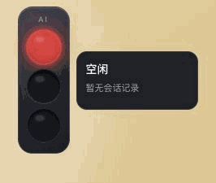
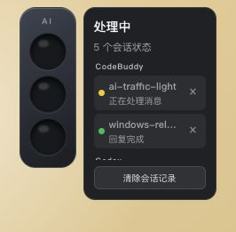
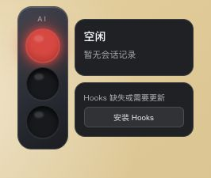

# AI Traffic Light

AI Traffic Light 是一个面向 CodeBuddy CN、Codex 和 Claude Code 的跨平台桌面悬浮状态灯。它使用竖排红绿灯显示当前对话状态，并在系统托盘保留入口。目前支持 macOS 和 Windows。

## 界面预览

| 空闲跑马灯 | 多会话状态 | Hooks 安装提示 |
| --- | --- | --- |
|  |  |  |

| 灯光 | 状态 | 说明 |
| --- | --- | --- |
| 黄灯闪烁 | 处理中 | AI 客户端正在处理消息或调用工具 |
| 红灯常亮 | 等待确认 | AI 客户端正在等待权限确认或补充信息 |
| 绿灯 | 已完成 | 回复已经完成，保持点亮直到下一次状态变化 |
| 红灯闪烁 | 执行异常 | 工具调用或响应失败 |
| 红黄绿依次点亮 | 空闲 | 当前没有活跃对话 |

## 工作原理

```text
CodeBuddy / Codex / Claude Hooks
  -> ~/.ai-traffic-light/sessions/<client>-<session-id>.json
  -> Tauri Rust 后端聚合多会话状态
  -> 悬浮红绿灯与系统托盘图标
```

多个对话同时存在时，按 `异常 > 等待确认 > 处理中 > 已完成 > 空闲` 的优先级显示。

CodeBuddy 当前没有单独的“普通回复正在等待用户选择” Hook。应用会优先使用工具确认信号，并在 `Stop` 时保守检查回复末尾是否明显在提问或列出选项。Codex 和 Claude Code 的标准 `PermissionRequest` 事件会直接显示等待确认。

## Codex 首次启用

> [!IMPORTANT]
> Codex 首次使用 AI Traffic Light 时，安装 Hooks 后还需要在 Codex 的新会话中检查并信任 AI Traffic Light 写入的 Hooks。未完成信任前，Codex 会发现这些 Hooks，但不会执行它们，因此红绿灯不会跟随 Codex 会话变化。

这是 Codex 对本机命令 Hook 的安全保护。AI Traffic Light 不会静默绕过该检查，也不会擅自替用户写入信任状态。

Codex 桌面版通常会在新对话面板上方显示 Hooks 检查提示，按提示同意即可。Codex CLI 可以在新会话中输入 `/hooks` 检查并信任 Hooks。Hooks 更新后，如果 Codex 提示定义发生变化，请再次按新对话顶部提示或 `/hooks` 重新检查并信任。

## 开发运行

需要 Node.js、pnpm 和 Rust 工具链。Windows 端 Hook 使用系统自带 PowerShell，无需额外安装 Python。

```bash
pnpm install
pnpm tauri:dev
```

启动后，应用会检查 Hooks 是否完整。仅在 Hooks 缺失或需要更新时，悬浮面板才会显示 **安装 Hooks** 按钮。安装器会把 Hook 脚本复制到 `~/.ai-traffic-light/hooks/`，并合并写入 `~/.codebuddy/settings.json`、`~/.codex/hooks.json` 和 `~/.claude/settings.json`。已有配置中的其他字段会保留。旧版 `~/.codebuddy-light/` Hook 会在重新安装时自动替换。

三个客户端都会在新会话启动时读取 Hooks 快照。安装或更新 Hooks 后，请先重启已打开的 AI 客户端，再新建会话验证灯光状态。Codex 用户还必须按照上方 **Codex 首次启用** 的说明，检查并信任新安装或发生变化的 Hooks。

也可以从托盘菜单选择 **安装 AI Hooks**。

## CodeBuddy Remote-SSH

CodeBuddy CN IDE 通过 SSH 打开服务器代码时，Hook 通常会在远端 Extension Host 中执行。普通本机 Hook 会写入服务器上的 `~/.ai-traffic-light/sessions`，本机 macOS/Windows 的悬浮灯无法直接读取，因此需要启用 SSH 桥接。

应用启动后会在本机 `127.0.0.1:37628` 上开启一个只监听本机回环地址的桥接端口。端口被占用时，桥接卡片会显示错误，需要退出占用该端口的程序后重启应用。使用步骤：

1. 将鼠标移到悬浮灯上，找到 **SSH 桥接** 卡片，点击 **生成远端脚本**。
2. 按卡片里的命令保持 SSH 反向隧道，例如：

```bash
ssh -N -R 37628:127.0.0.1:37628 user@server
```

3. 把生成的 `~/.ai-traffic-light/install-codebuddy-remote-hook.sh` 复制到服务器并执行：

```bash
scp ~/.ai-traffic-light/install-codebuddy-remote-hook.sh user@server:~/
ssh user@server 'bash ~/install-codebuddy-remote-hook.sh'
```

4. 重启远端 CodeBuddy 会话或重新打开 SSH 工作区，再新建对话验证状态灯。

远端脚本会写入服务器上的 `~/.codebuddy/settings.json`，写入前会在同目录生成 `settings.ai-traffic-light-backup-*.json` 备份；状态会通过反向隧道发回本机应用。桥接地址包含本机生成的 token；不要把生成的远端脚本提交到仓库或发给不可信的人。

托盘菜单提供 **开机自启动** 和 **清除会话记录** 选项。悬浮面板会列出当前会话及其最近状态，支持删除单条记录或清除全部记录。

AI Traffic Light 会分别监听 CodeBuddy、Codex 和 Claude 的本次运行周期。观察到某个客户端退出后，本轮监听到的对应会话记录会自动移除；异常残留的记录也会按状态定期回收。

## 本地模拟

不启动 CodeBuddy 也可以切换 UI 状态：

```bash
python3 scripts/simulate.py working
python3 scripts/simulate.py waiting
python3 scripts/simulate.py completed
python3 scripts/simulate.py error
python3 scripts/simulate.py idle
```

## 构建安装包

在对应操作系统上运行：

```bash
pnpm tauri:build
```

macOS 会生成应用包，Windows 会生成 Windows 安装包。仓库的 GitHub Actions 会在 macOS 与 Windows Runner 上分别执行构建检查和 Hook smoke test。

Windows 普通用户请优先使用安装版。安装版内嵌 WebView2 Evergreen Bootstrapper，会在系统缺少 WebView2 Runtime 时引导联网安装。便携版不会自动安装 WebView2，仅适用于系统已经具备 WebView2 Runtime 的电脑。

## 当前阶段

当前版本已经可以日常使用，支持 CodeBuddy CN、Codex 和 Claude Code，提供 macOS 与 Windows 安装包。

应用已经实现多会话状态聚合、按客户端分组展示、系统托盘入口、开机自启动、Hook 自动检查与更新、历史会话自动回收和手动清理。后续会继续补充声音提醒等体验优化。

## License

[MIT](LICENSE)
